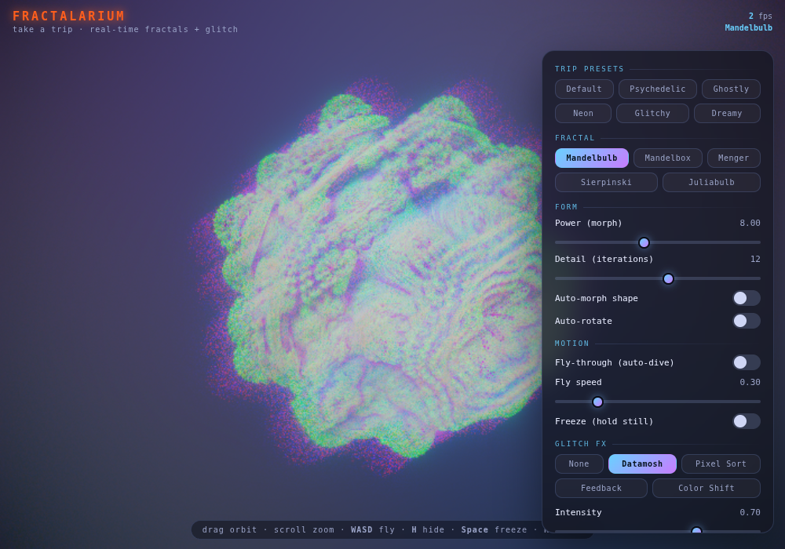

# Fractalarium — a trippy browser fractal explorer

A real-time, interactive **3D fractal** explorer that runs entirely in the browser.
Inspired by the gorgeous [Mandelbulber2](https://github.com/buddhi1980/mandelbulber2)
desktop renderer, this is a lightweight, zero-dependency, "more interactive vibe"
take: a single HTML file that ray-marches fractals on the GPU with WebGL — then runs
the result through a live **glitch / datamosh post-processing** pipeline.

## Try it

Just open `index.html` in any WebGL-capable browser — no build step, no server, no
dependencies. Or host the folder (e.g. GitHub Pages) and share the link.

## Fractals

Pick from a formula dropdown, each with its own sensible default framing:

- **Mandelbulb** — the classic power-N bulb
- **Mandelbox** — box-fold / sphere-fold architecture
- **Menger sponge** — recursive cubic lattice
- **Sierpinski** — kaleidoscopic tetrahedron (KIFS)
- **Juliabulb** — the Julia variant of the Mandelbulb (fixed `c`)

The **Shape / power** slider means something different per fractal (exponent, box
scale, fold scale) and can be auto-morphed for a breathing effect.

## Glitch FX (take a trip)

The rendered fractal is piped through a second WebGL pass with a ping-pong
feedback buffer, so you can melt it in real time:

- **Effects**: None, **Datamosh** (chromatic channel displacement + trails),
  **Pixel Sort**, **Feedback** (rotating/zooming tunnel echoes), **Color Shift**
  (animated RGB separation)
- **Intensity / Displace / Trails / Threshold** to dial the chaos
- **Color grade**: hue drift, brightness, contrast, saturation
- **Trip presets**: Default, Psychedelic, Ghostly, Neon, Glitchy, Dreamy — one tap
  sets the effect, FX, color grade and palette together
- **Freeze** to hold the scene still, **Record** to capture MP4/WebM video, and
  **Save PNG** for stills

### Camera source

You can also feed your **live webcam** into the same glitch pipeline:

- **Off** — pure fractal (default)
- **Background** — the fractal floats over your camera feed (composited via the
  fractal's hit mask)
- **Blend** — cross-fade fractal and camera with the blend slider
- **Camera only** — the classic datamosh-over-webcam toy, now inside Fractalarium
- **Flip camera** — switch front/back on devices with more than one

The camera starts only when you pick a mode (a permission prompt appears), stops
when you return to Off, and is deliberately **never** encoded into shareable links —
a shared trip never activates someone else's camera.

(Presets and the glitch pipeline are adapted from a webcam "datamosh" toy; the
media-file upload and audio+video "clip studio" queue from that toy are not
included, since the fractal renderer is the primary source here.)

## Controls

- **Drag** to orbit · **scroll / pinch** to zoom (down to close-up detail)
- **WASD** to fly through the fractal · **Q/E** up/down · **Fly-through (auto-dive)**
  toggle for a hands-free infinite dive (great with Mandelbox / Menger)
- **Auto-morph shape** / **Auto-rotate** for motion
- **Detail (iterations)** — recursion depth
- **Palettes + Hue shift** — seven cosine-gradient color moods, orbit-trap driven
- **Glow / Light angle** — mood and key-light direction
- **Quality** — Draft → Ultra (trades resolution/steps for framerate)
- **Soft shadows** — toggle the shadow march
- **Surprise me** — randomize everything · **Save PNG** — grab the current frame

### Shareable links
The full scene — fractal, all parameters, palette, **and the exact camera** — is
encoded into the URL. Click **Copy link** to grab a link that reopens the exact
same view, or just bookmark/refresh: the URL updates live as you explore.

### Keyboard
`WASD`/`Q`/`E` fly · `H` hide/show UI · `Space` pause · `R` reset view · `F` fullscreen

## How it works (quick tour)

- A single full-screen triangle runs the fragment shader for every pixel.
- `map()` selects the active fractal's **distance estimator** and returns both the
  distance and an *orbit trap* (used for coloring).
- The ray marcher steps along each ray by the estimated distance until it hits a
  surface; normals come from the DE gradient, with soft shadows, ambient
  occlusion, fresnel rim light, and a volumetric glow pass.
- The camera is a yaw/pitch/distance orbit around a movable target; flying just
  moves that target through the field. All controls are uniforms, so everything
  updates live with no shader recompilation.

## Notes

- Runs on WebGL 1 for broad compatibility. Rendering resolution scales with the
  Quality setting and device pixel ratio.
- Software renderers (e.g. headless/SwiftShader) work but are slow; a real GPU
  gives smooth interaction.

Not affiliated with Mandelbulber2 — just a fan's browser tribute to it.
